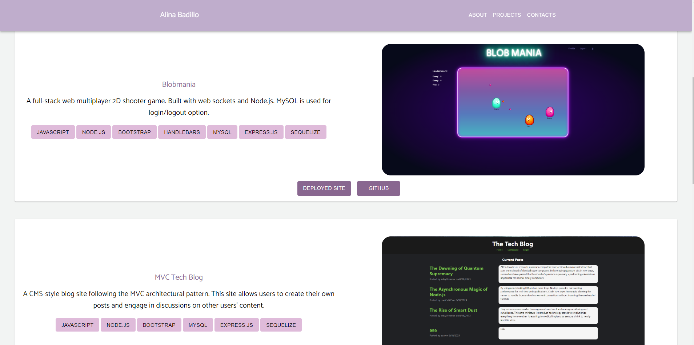

# personal-portfolio-react

[](https://opensource.org/licenses/MIT)

## Description
A personal single-page portfolio made in React and React's open-source library - Material UI.

## Table of Contents
- [Technologies](#technologies)
- [Installation](#installation)
- [Usage](#usage)
- [License](#license)
- [Questions](#questions)

## Technologies


## Installation
Clone the repository:
```
git clone git@github.com:AlinaB108/personal-portfolio-react.git
```
Install node packages:
```
npm i 
```

## Usage

You can check my portfolio [here](https://alinab-108.netlify.app/)

## License
[](https://opensource.org/licenses/MIT)

https://opensource.org/licenses/MIT 
    
## Questions
If you have any questions, send me a message [GitHub](https://github.com/AlinaB108) or send me an email: [alinachristabel108@gmail.com](alinachristabel108@gmail.com)